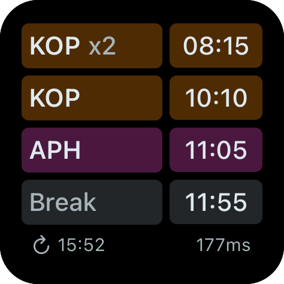
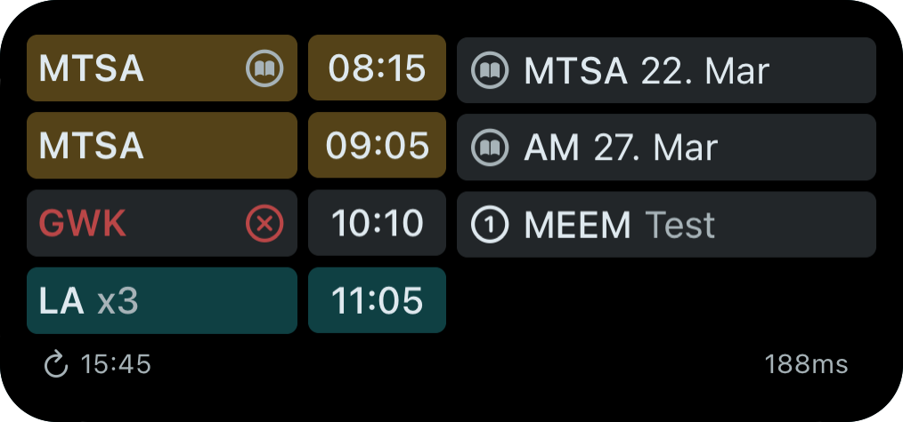

# Untis Widget for Scriptable

iOS Widgets for [Untis](https://webuntis.com/) using [Scriptable](https://scriptable.app/) to display important information about school life directly on the homescreen.

## ❔ What is this for?
Untis is a service used by many students to keep track of their school-life, especially for checking the timetable.
There is a mobile app, but it does not provide any widgets.
That's why I decided to create those widgets myself, so I can have the most important information directly on my homescreen.

## ✨ Features
The script allows you to display data for one WebUntis account in a widget, and will notify you about important changes.\
You can set what information (views) should be displayed for each widget.\
To safe battery and bandwidth, the data is updated at the start of every lesson and every few hours outside of school-hours.\
The fetched data is cached for some time, so the script takes less time, bandwidth and battery to run.\
Many things can be configured via the configuration file `untis-config.json` in the scriptable folder, check the [configuration section](#⚙️-configuration) for details.

### 🔔 Notifications
You will be notified about the following changes/events:
- Lessons (canceled, shifted, teacher changed, ...)
- Exams (upcoming)
- Grades (added)
- Absences (added)

Please understand that the notifications can only be sent as soon as the script runs the next time.

### 🪟 Views
#### Lessons
Shows the upcoming lessons, meaning their subject, when they begin and some special information.
Lessons can be colored, and if there is enough space, the long subject-names and end-times are displayed.
After a school day has ended, a summary of the next day is displayed. (list of subjects)

#### Exams
Shows the upcoming exams, meaning their subject and date.
You can configure how many days ahead the exams should be displayed and set a maximum count.

#### Grades
Displays the recent grades you received. (subject + mark)
You can configure how long grades should be displayed and set a maximum count.

#### Absences
Lists open (unexcused) absences with their date and duration.

## 📥 Installation
1. Before installing the script, you need to [install Scriptable from the AppStore](https://apps.apple.com/us/app/scriptable/id1405459188?uo=4).

2. To install the script, head over to the [releases page](https://github.com/JFK-05/scriptable-untis/releases) select the latest release.\
If you always want to check out the latest features, which might not be stable, you can download the beta release.\
Alternatively, you can download the latest stable release [here](https://github.com/JFK-05/scriptable-untis/releases/latest/download/UntisWidget.scriptable).

3. After downloading the file, you can click to open it with scriptable.
This will add the script to the list.

4. Open Scriptable, click the script to run it.
You will be asked what you want to do.
Select `🔑 Change Credentials` and enter your WebUntis credentials as prompted.\
You will be asked for the url, which you can find when selecting you school [here](https://arche.webuntis.com/WebUntis/?school=litec#/basic/login). You might have to click the "switch school" button to get to the correct page. The url should look something like this: `https://<server>.webuntis.com/WebUntis/?school=<schoolname>#/basic/login`. (with `<server>` and `<schoolname>` replaced)

5. Now you can add an IOS widget for Scriptable and select the script in the options.

6. The widget should update automatically and display the information. 🥳

7. If you want to customize the widget (e.g. color the lessons, see the [configuration section](#⚙️-configuration))

## ⚙️ Configuration
When long-pressing the widget, you see the iOS widget configuration.
In the `Parameter` field, you can enter the configuration for the widget.
The configuration is a list of the views you want to be displayed, separated by a comma.\
For larger widgets, you can create multiple columns by separating the views with a pipe (`|`).\
Example: `lessons,exams` or `lessons|exams,grades,absences`

### 📄 Config File
The configuration file `untis-config.json` is located in the scriptable folder.\
A default configuration file is created when the script is run for the first time. Check it out to see what's possible!\
Changes to the configuration file are applied when the script is run again.\
I am aware that editing this json file is not the most user-friendly way, I am considering adding a visual configuration tool.

## 🧑‍💻 A Note for Developers
For quite some time, all the code was in one file.\
I was aware of how unpleasant this is and always wanted to split it up.\
But I thought that this would kind of defeat the point of scriptable, since a bundled file is not really as readable.\
In the end I decided to still split it, as this makes the source code way easier to read and maintain.
I tried to bundle it using [webpack](https://webpack.js.org/), but ran into some problems: The emitted code would not await the result, therefore Scriptable exited before the code was executed.\
That's why I switched to [rollup](https://rollupjs.org/), which worked perfectly. The emitted code even is quite readable now, nearly as much as if it was written directly in javascript.
